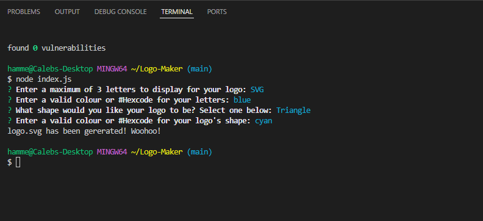
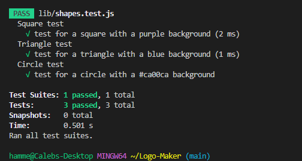
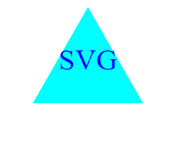

# Logo-Maker
a repo for logo making code
## Table of Contents

- [Description](#description)
- [User Story](#user-story)
- [Acceptance Criteria](#acceptance-criteria)
- [Preview Images](#preview-images) 
- [Link To Video Walkthrough](#link-to-video-walkthrough)
- [Installation](#installation)
- [Tests](#tests)
- [Technologies Used](#technologies-used)
- [Credits](#credits)
- [License](#license)

## Descriptiom

A Node.js command-line application that takes in user input to generate a logo and save it as an SVG File. The application prompts the user to select a color and shape, provide text for the logo, and save the generated SVG to a .svg file.

The application will be invoked by using the following command:

```bash
node index.js
```

## User Story

```md
AS a freelance web developer
I WANT to generate a simple logo for my projects
SO THAT I don't have to pay a graphic designer
```

## Acceptance Criteria

```md
GIVEN a command-line application that accepts user input
WHEN I am prompted for text
THEN I can enter up to three characters
WHEN I am prompted for the text color
THEN I can enter a color keyword (OR a hexadecimal number)
WHEN I am prompted for a shape
THEN I am presented with a list of shapes to choose from: circle, triangle, and square
WHEN I am prompted for the shape's color
THEN I can enter a color keyword (OR a hexadecimal number)
WHEN I have entered input for all the prompts
THEN an SVG file is created named `logo.svg`
AND the output text "Generated logo.svg" is printed in the command line
WHEN I open the `logo.svg` file in a browser
THEN I am shown a 300x200 pixel image that matches the criteria I entered
```

## Preview Images
- ## The Terminal Prompts

- ## The Terminal Test

- ## The Logo Generated Result


## Link To Video Walkthrough
**Walkthrough:** [Link to the walkthrough video!](https://drive.google.com/file/d/13v_FAyDoal0MsDa08pqbfFKsXSKVuiTP/view) 


## Installation
- To clone the repo: https://github.com/Hammerc124/Logo-Maker
- Install [Node](https://nodejs.org/en). version 16 and up. Command line: npm init 
- Install the [Inquirer package](https://www.npmjs.com/package/inquirer/v/8.2.4). version 8.2.4. Command line: npm i inquirer@8.2.4
- Then install [Jest](https://jestjs.io/). Command line: npm i jest
- Run the application using Command: node index.js

## Tests
- To run a test, use one of the commands below in your terminal: <br>
1. npm test <br>
or <br>
2. jest test <br>

## Technologies Used
Assignment was built with:
- JavaScript
- Inquirer
- Jest
- Node.js
- VS Code
- Github


## Credits
- Caleb Hammer
- Course: Bootcamp Full Stack Development
- Instructor: Ragheed al-Midani
- Learing Assistant Ask BCS Support
- License badges: Sheilds.io


## License

